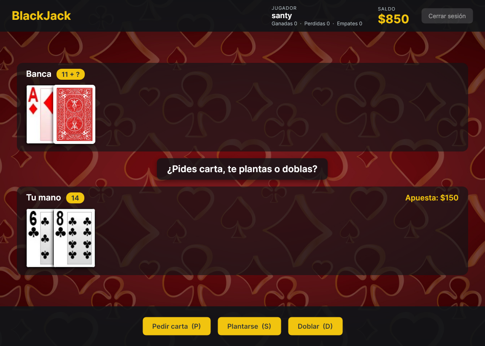
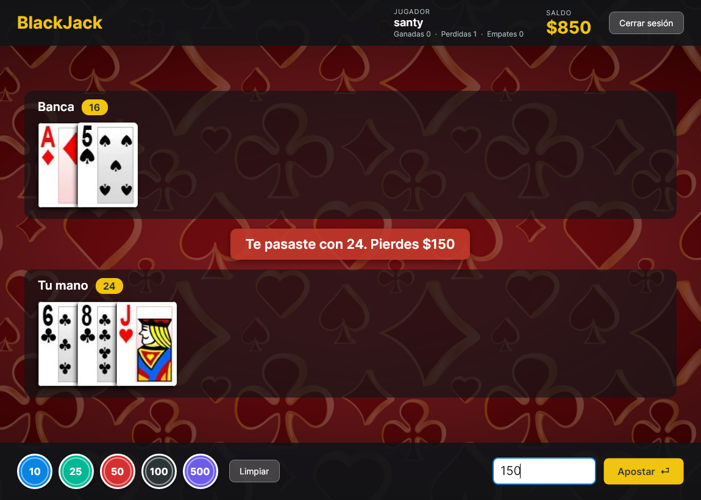

# BlackJack

Juego de Blackjack de escritorio contra la banca, con **cuentas de jugador** que guardan el saldo y las
estadísticas entre partidas.

Funciona en **Windows y Linux** (y macOS). Está hecho en **C# / .NET 10** con **Avalonia** para la interfaz.



---

## Contenido

1. Características
2. Reglas del juego
3. Instalación y ejecución
4. Cómo se juega
5. Datos guardados
6. Arquitectura
7. Documentación del código (Doxygen)

---

## 1. Características

- **Cuentas de jugador:** cada jugador crea su cuenta con usuario y contraseña. Empieza con $1000 y su saldo,
  rondas ganadas, perdidas y empatadas se conservan entre partidas.
- **Reglas de casino** (ver la sección 2): blackjack natural 3:2, doblar, banca que se planta con 17 suave.
- **Apuestas rápidas** con fichas de 10, 25, 50, 100 y 500, o escribiendo la cantidad y pulsando **Enter**.
- **Atajos de teclado** durante la mano: **P** pedir carta, **S** plantarse, **D** doblar.
- **Historial** de cada sesión en un archivo de texto: apuestas, cartas y resultados.
- Si el saldo llega a $0, se puede **recargar** $1000 para seguir jugando.

---

## 2. Reglas del juego

| Regla | Detalle |
|---|---|
| Objetivo | Acercarse más que la banca a 21 sin pasarse. |
| Valor de las cartas | 2 a 10 valen su número; J, Q y K valen 10; el As vale 11, o 1 si con 11 la mano pasa de 21. |
| Mano suave | Mano con un As que cuenta como 11. Mientras juegas se muestran sus dos valores, por ejemplo `7/17`. |
| Reparto | Primero se apuesta; después se reparten dos cartas a cada uno, en orden jugador, banca, jugador, banca. La segunda carta de la banca queda boca abajo. |
| Blackjack natural | 21 con las dos primeras cartas. Paga **3:2** (apostando $100 se ganan $150). Si ambos lo tienen, es empate. |
| Blackjack de la banca | Se revisa antes del turno del jugador; si la banca lo tiene, la ronda termina. |
| Pedir carta | Se puede pedir mientras la mano no pase de 21. Con 21 el jugador se planta automáticamente. |
| Doblar | Solo con las dos primeras cartas: se duplica la apuesta, se recibe **una** carta y termina el turno. |
| Turno de la banca | Pide carta hasta llegar a 17 o más, y se planta con 17 suave. |
| Pagos | Ganar paga 1:1; el empate devuelve la apuesta; perder la pierde. |

> Con apuestas impares el pago de 3:2 se redondea hacia abajo (apostando $25 se ganan $37).

---

## 3. Instalación y ejecución

### Ejecutar desde el código

Requisito: [.NET 10 SDK](https://dotnet.microsoft.com/download).

```bash
git clone https://github.com/santyxswc/BlackJack-CS.git
cd BlackJack-CS
dotnet run --project BlackJack.Avalonia
```

### Publicar un ejecutable

Genera un ejecutable que incluye .NET, así el equipo donde se juegue no necesita instalar nada:

```bash
# Windows (genera BlackJack.exe)
dotnet publish BlackJack.Avalonia -c Release -r win-x64 --self-contained -p:PublishSingleFile=true -p:IncludeNativeLibrariesForSelfExtract=true -o publicado/windows

# Linux (genera BlackJack)
dotnet publish BlackJack.Avalonia -c Release -r linux-x64 --self-contained -p:PublishSingleFile=true -p:IncludeNativeLibrariesForSelfExtract=true -o publicado/linux
```

Se puede generar cualquiera de los dos desde Windows o desde Linux. Hay que entregar la **carpeta completa**:
el ejecutable necesita la carpeta `imagenes` a su lado.

---

## 4. Cómo se juega

### Iniciar sesión


- **Primera vez:** escribe un usuario (3 a 20 caracteres) y una contraseña (mínimo 4) y pulsa
  **Crear cuenta nueva**.
- **Siguientes veces:** escribe tus datos y pulsa **Entrar** (o Enter).

### Una ronda

1. **Apuesta:** pulsa las fichas para sumar o escribe la cantidad, y pulsa **Apostar** o Enter. La cantidad
   queda escrita, así que para repetir la apuesta en la siguiente ronda basta con pulsar Enter.
2. **Tu turno:** mira tu mano y la carta visible de la banca, y elige **Pedir carta (P)**, **Plantarse (S)**
   o **Doblar (D)**.
3. **Resultado:** el aviso del centro muestra si ganaste, perdiste o empataste y cuánto; el saldo y las
   estadísticas se actualizan y se guardan.



**Cerrar sesión** vuelve a la pantalla de inicio para que juegue otra persona. Si cierras la ventana en medio
de una mano, te plantas con las cartas que tienes y el resultado se guarda.

---

## 5. Datos guardados

Los datos se guardan en la carpeta de datos del usuario:

| Sistema | Carpeta |
|---|---|
| Linux | `~/.local/share/BlackJack/` |
| Windows | `%LOCALAPPDATA%\BlackJack\` |
| macOS | `~/Library/Application Support/BlackJack/` |

- `jugadores.json`: cuentas con su saldo y estadísticas. Las contraseñas se guardan con **PBKDF2-SHA256** y una
  sal aleatoria, nunca en texto plano. El archivo se escribe primero en una copia temporal, así no queda dañado
  si el juego se cierra mientras guarda.
- `historial/partida_<usuario>_<fecha>.txt`: un archivo por sesión con cada apuesta, las cartas y el resultado
  de cada ronda.

---

## 6. Arquitectura

```
BlackJack-CS/
├── BlackJack.Avalonia/
│   ├── Juego/                   Reglas del juego (sin interfaz gráfica)
│   │   ├── MesaBlackjack.cs     Controla la ronda: apuesta, reparto, turnos y pagos
│   │   ├── Jugador.cs           Mano, saldo y apuesta del jugador
│   │   ├── ManoJugador.cs       Mano de la banca
│   │   ├── Baraja.cs            52 cartas mezcladas
│   │   └── Carta.cs             Valor y palo
│   ├── Datos/
│   │   ├── RepositorioJugadores.cs  Cuentas en jugadores.json
│   │   └── Historial.cs             Archivo de texto de cada sesión
│   ├── LoginWindow.axaml(.cs)   Inicio de sesión y creación de cuentas
│   ├── MainWindow.axaml(.cs)    Mesa de juego
│   ├── Recursos.cs              Carga de imágenes
│   ├── App.axaml                Estilos (botones, fichas, campos)
│   └── imagenes/                Cartas, reverso y fondo
├── docs/capturas/               Capturas de este documento
├── BlackJack.slnx               Solución
└── Doxyfile                     Configuración de la documentación
```

Las reglas están separadas de la interfaz: `MesaBlackjack` no sabe nada de ventanas ni botones, y la mesa
(`MainWindow`) solo le pide jugadas y dibuja el resultado. Así las reglas se pueden probar con barajas en un
orden fijo (`Baraja(IEnumerable<Carta>)`), sin abrir el juego.

---

## 7. Documentación del código (Doxygen)

El código está documentado con comentarios Doxygen (`@file`, `@brief`, `@param`, `@return`, `@exception`).
Para generar la documentación HTML:

```bash
doxygen            # usa el Doxyfile de la raíz
```

El resultado queda en `docs/html/index.html` (esta carpeta no se sube al repositorio).

---

**Autor:** Santiago Caicedo
